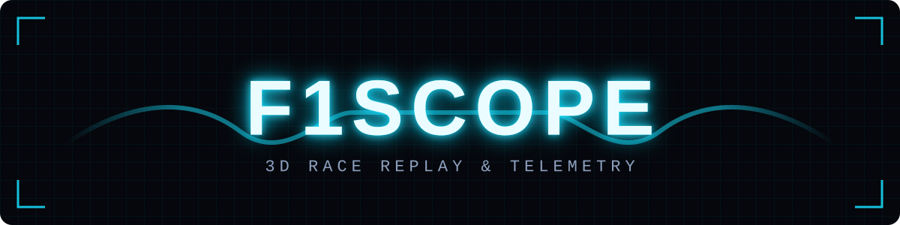
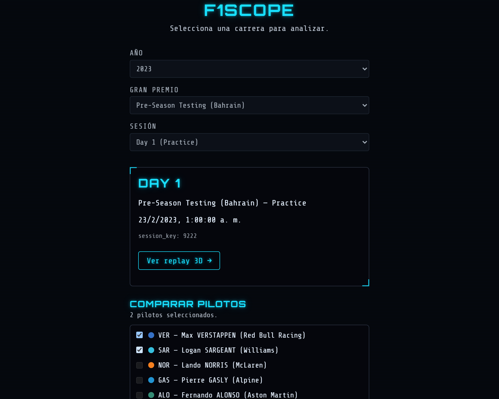
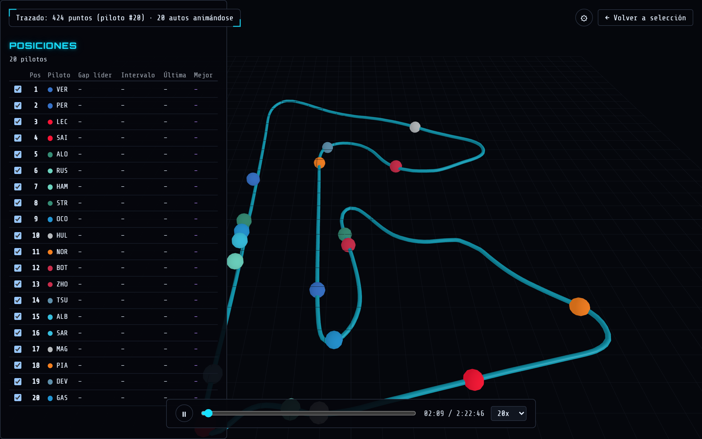
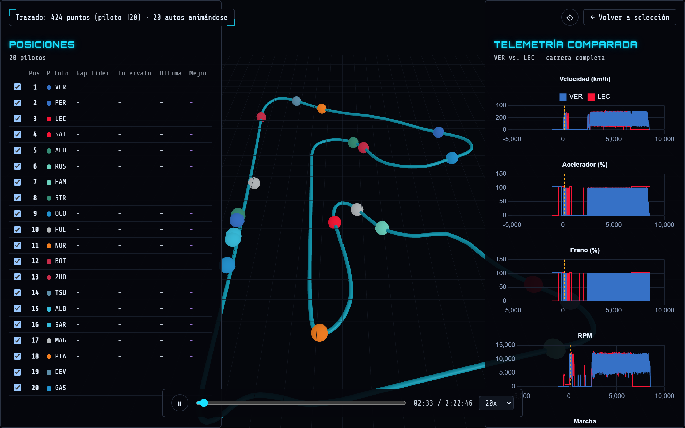
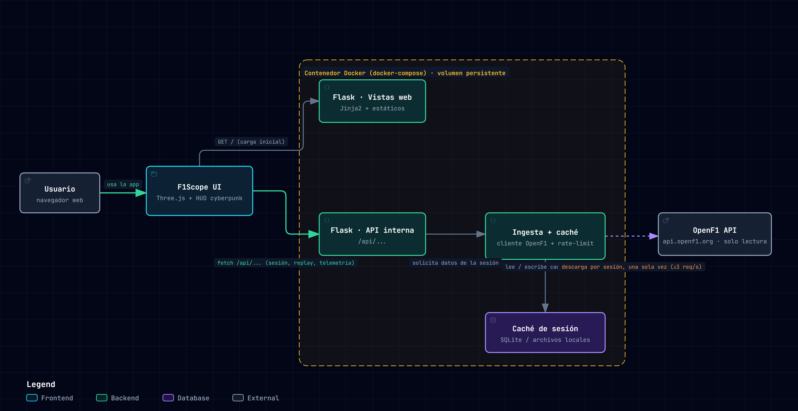

<p align="center">
  
</p>

<p align="center">
  
  
  
  
  
  <br>
  
  
  
  
</p>

F1Scope turns a historical Formula 1 session into an interactive 3D replay. Pick any race
weekend from 2023 onward, and watch the full grid move in real time around a to-scale
reconstruction of the actual circuit — play, pause, scrub through the timeline, or jump to
1×–100× speed, exactly like scrubbing a broadcast recording. A live HUD tracks positions,
gaps to the leader, intervals and lap times as the replay plays, so the standings panel tells
the same story the 3D scene is showing. Pick two drivers and a side-by-side telemetry panel
compares their speed, throttle, brake, RPM and gear across the entire race, with a synced
cursor that tracks the same clock as the 3D replay — pause the car and the chart pauses with
it. Everything runs on real session data: pulled once from [OpenF1](https://openf1.org/)'s
free public API, cached locally, and never re-fetched, so the second time you watch a session
it loads instantly. The whole thing is wrapped in a self-contained Docker image you can have
running with one command.

See [DESCRIPTION.MD](DESCRIPTION.MD) for the project pitch, [docs/PLANNING.md](docs/PLANNING.md)
for the approved scope/architecture, and [docs/architecture/](docs/architecture/) for the
interactive architecture diagram.

## Screenshots

<p align="center">
  <a href="docs/screenshots/session-select.png"></a>
  <a href="docs/screenshots/replay-hud.png"></a>
  <a href="docs/screenshots/telemetry.png"></a>
</p>

## Stack

Python + Flask, packaged with Docker. Data comes from OpenF1's free-tier API (historical
sessions, 3 req/s / 30 req/min rate limit) — sessions are ingested once and served from a
local cache, never re-fetched per request. See `docs/PLANNING.md` for the full rationale.

## Architecture

<p align="center">
  <a href="docs/architecture/f1scope-arquitectura.png">
    
  </a>
</p>

An interactive version of this diagram (pan/zoom, click a node for detail) is at
[docs/architecture/f1scope-architecture.html](docs/architecture/f1scope-architecture.html).

There are exactly two request paths through the app, both served by the same Flask process
inside the Docker container:

1. **Page loads** (`GET /`, `GET /replay`) return server-rendered HTML — Jinja2 templates
   plus the static JS/CSS bundle (Three.js for the 3D scene, Chart.js for telemetry, the
   cyberpunk theme). This is the "Flask · Vistas web" box: it never talks to OpenF1 or the
   cache, it just ships the page that then runs in the browser.
2. **Data fetches** (`fetch('/api/...')`, made by that browser-side JS after the page has
   loaded) hit the internal JSON API — "Flask · API interna". Session/meeting/driver
   *browsing* endpoints (`/api/sessions`, `/api/meetings`, `/api/drivers`) proxy straight
   through to OpenF1 live, since those payloads are small and only fetched once per browse
   action. Everything needed to actually replay a session (`/api/session/<key>/track`,
   `/cars`, `/telemetry`, `/standings`) instead goes through **ingestion + cache**
   (`get_or_ingest_session`, the "Ingesta + caché" box): the first request for a given
   `session_key` triggers a full pull from OpenF1 — through the rate-limited client, capped
   at OpenF1's free-tier 3 req/s / 30 req/min — and everything it returns is written to a
   local per-session cache (plain JSON files, one per OpenF1 endpoint, under
   `instance/cache/<session_key>/` — see `app/services/cache.py`'s module docstring for why
   files instead of a database). Every request after that for the same session reads straight
   from that cache and never touches OpenF1 again.

That cache directory is what `docker-compose.yml`'s named volume (the dashed box in the
diagram) persists across container restarts — without it, "ingested once" would really mean
"ingested once per container lifetime," and every `docker compose down`/`up` would re-pull
and re-throttle through OpenF1 for sessions you'd already watched.

## Project structure

```
app/
├── routes/     # Blueprints: web views (HTML) + internal JSON API (/api/...)
├── services/   # OpenF1 client, ingestion, cache (milestone E2)
├── models/     # Internal data structures/schemas
├── static/     # CSS/JS
└── templates/  # Jinja2 templates
docker/
├── Dockerfile          # Flask app image (gunicorn entrypoint)
└── docker-compose.yml  # One-command stack: builds the image, persists the cache volume
tests/            # Unit + integration tests (pytest)
```

## Getting started

```bash
python -m venv .venv
# Windows: .venv\Scripts\activate    macOS/Linux: source .venv/bin/activate
pip install -r requirements-dev.txt
cp .env.example .env

flask --app wsgi run
```

The app boots with a `development` config by default (see `app/config.py`); no API key is
needed for OpenF1's free tier.

## Running with Docker

The whole app — no local Python install needed — with one command from the repo root:

```bash
cp .env.example .env          # first time only; docker-compose reuses this file
docker compose -f docker/docker-compose.yml up --build
```

Then open http://localhost:5000.

- `docker/Dockerfile` builds a `python:3.11-slim` image running the app under
  [gunicorn](https://gunicorn.org/) (Flask's own dev server isn't meant for this — see the
  warning it prints when you run it directly).
- `docker/docker-compose.yml` publishes port 5000 and mounts a **named volume**
  (`f1scope-cache`, at `/app/instance/cache`) so sessions you've already ingested from OpenF1
  survive container restarts — `docker compose down` keeps it; `docker compose down -v` is
  the explicit opt-in to wipe it and start fresh.
- The **first** request for a given session is slow (a full ingestion makes ~50 rate-limited
  OpenF1 requests — up to a few minutes for a full race with 20 drivers); every request after
  that for the same `session_key` is served from the cache and is fast. This is expected, not
  a hang.
- Rebuild after changing `requirements.txt` or anything under `app/`:
  `docker compose -f docker/docker-compose.yml up --build`.

### Environment variables

Read from `.env` (see `.env.example`) both locally and inside the container — copy it once,
adjust as needed:

| Variable | Default | Notes |
|---|---|---|
| `FLASK_ENV` | `development` | The Docker image always runs as `production` regardless of this value (set explicitly in `docker-compose.yml`) — gunicorn is already the entrypoint, so the dev-server-only `development` mode has no effect there. |
| `SECRET_KEY` | `change-me-in-production` | Signs sessions/cookies. Set a real random value for any deployment reachable by anyone but you. |
| `OPENF1_BASE_URL` | `https://api.openf1.org/v1` | OpenF1 is a free, read-only, public API — no key required for v1. |
| `CACHE_DIR` | `instance/cache` | Where ingested sessions are cached. Inside Docker this resolves to `/app/instance/cache`, the path the named volume mounts over — change both together if you ever change one. |

## Code conventions

Linting and formatting are handled by [Ruff](https://docs.astral.sh/ruff/) (config in
`pyproject.toml`). Run both before committing:

```bash
ruff check .           # lint
ruff format .          # auto-format
```

Tests (unit tests for the OpenF1 client/ingestion/cache layer, integration tests for the
internal API — see `tests/`) run with [pytest](https://docs.pytest.org/):

```bash
pytest
```

- `requirements.txt` — runtime dependencies only (includes gunicorn, the Docker image's
  production WSGI server — not used by local `flask run`/`python wsgi.py`, but a runtime,
  not dev-only, dependency).
- `requirements-dev.txt` — adds dev/test tooling (Ruff, pytest) on top of the runtime ones.
- Commits follow the standardized pipeline in `.claude/skills/commit/` (branch check,
  security scan, one atomic commit per logical change, referencing the GitHub issue it
  advances).
